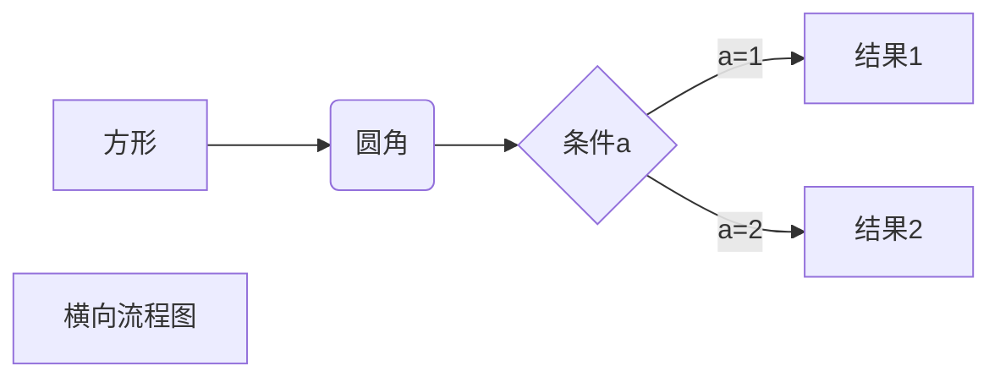
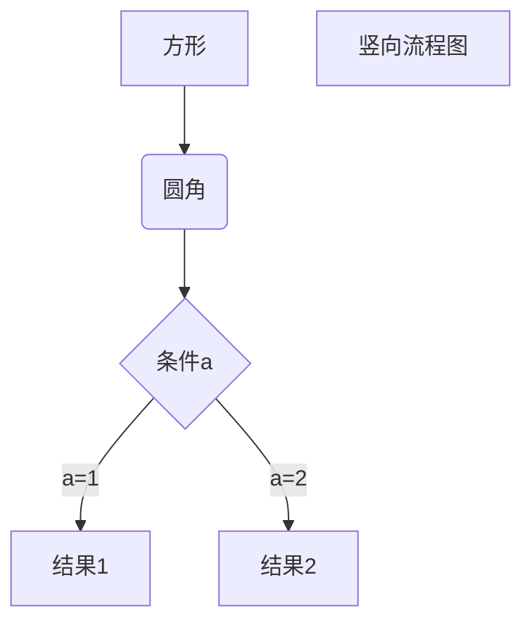
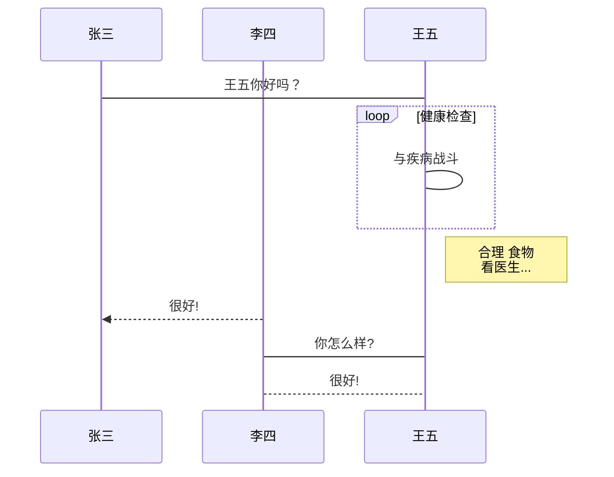
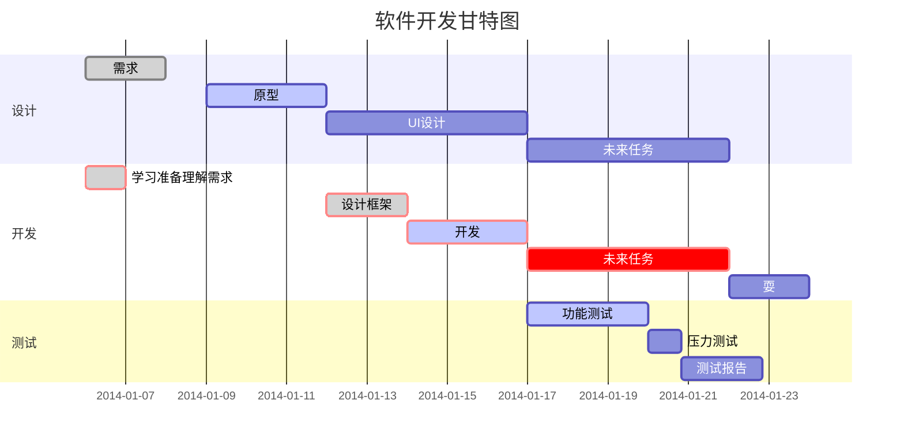

# Markdown 教程 

原地址: https://www.runoob.com/markdown/md-tutorial.html

## Markdown 标题

#### `=`一级标题 

```markdown
我展示的是一级标题
=================
```

#### `-`二级标题
```
我展示的是二级标题
-----------------
```
#### `#`号标记
使用 `#` 号可表示 1-6 级标题，一级标题对应一个 `#` 号，二级标题对应两个 `#` 号，以此类推。
```markdown
# 一级标题
## 二级标题
### 三级标题
#### 四级标题
##### 五级标题
###### 六级标题
```
***

## Markdown 段落 
#### 段落
没有特殊的格式，直接编写文字就好。 
段落的换行是使用`两个以上空格`加上`回车`。
也可以在段落后面使用一个`空行`来表示重新开始一个段落。

#### 字体
```
*斜体文本*
_斜体文本_
**粗体文本**
__粗体文本__
***粗斜体文本***
___粗斜体文本___
```

#### 分隔线
可以在一行中用三个以上的`星号` `减号` `底线`来建立一个分隔线，行内不能有其他东西。
也可以在`星号`或是`减号`中间插入`空格`。

```markdown
***
* * *
*****
- - -
----------
```

#### 删除线
在文字的两端加上两个波浪线 `~~`。
```markdown
RUNOOB.COM
GOOGLE.COM
~~BAIDU.COM~~
```

#### 下划线
通过 HTML 的 `<u>` 标签实现。
```markdown
<u>带下划线文本</u>
```

#### 脚注
脚注是对文本的补充说明。
```markdown
演示效果[^这是脚注]
```
演示效果[^这是脚注]
***

## Markdown 列表
#### 无序列表
使用星号`*` 加号`+`或是减号`-`作为列表标记。
```markdown
* 第一项
* 第二项
* 第三项

+ 第一项
+ 第二项
+ 第三项

- 第一项
- 第二项
- 第三项
```

#### 有序列表
使用`数字加上.`来表示。
```
1. 第一项
2. 第二项
3. 第三项
```

#### 列表嵌套
在子列表中的选项添加四个空格。
```markdown
1. 第一项：
    - 第一项嵌套的第一个元素
    - 第一项嵌套的第二个元素
2. 第二项：
    - 第二项嵌套的第一个元素
    - 第二项嵌套的第二个元素
```
***

## Markdown 区块
在段落开头使用 `> 空格`
```markdown
> 区块引用
> 菜鸟教程
> 学的不仅是技术更是梦想
```
区块可以嵌套。
一个`>`符号是最外层，两个`>`符号是第一层嵌套，以此类推。
```markdown
> 最外层
> > 第一层嵌套
> > > 第二层嵌套
```

#### 区块中使用列表
```markdown
> 区块中使用列表
> 1. 第一项
> 2. 第二项
> + 第一项
> + 第二项
> + 第三项
```

#### 列表中使用区块
在`>` 前添加四个空格。
```markdown
* 第一项
    > 菜鸟教程
    > 学的不仅是技术更是梦想
* 第二项
```
***

## Markdown 代码
#### 函数片段
用反引号\`把代码片段包起来

#### 代码区块
4 个空格或者一个制表符（Tab 键）。
也可以用\```包裹一段代码，并指定一种语言（也可以不指定）。
***

## Markdown 链接
#### 普通链接
```markdown
[链接名称](链接地址)

或者

<链接地址>
```

#### 高级链接
```markdown
这个链接用 1 作为网址变量 [Google][1]
这个链接用 runoob 作为网址变量 [Runoob][runoob]
然后在文档的结尾为变量赋值（网址）

  [1]: http://www.google.com/
  [runoob]: http://www.runoob.com/
```
***

## Markdown 图片
#### 普通方式
```markdown


```
示例：
```markdown


```


#### 图片网址使用变量

```markdown
这个链接用 1 作为网址变量 [RUNOOB][1].
然后在文档的结尾为变量赋值（网址）

[1]: http://static.runoob.com/images/runoob-logo.png
```
这个链接用 1 作为网址变量 [RUNOOB][1].
然后在文档的结尾为变量赋值（网址）

[1]: http://static.runoob.com/images/runoob-logo.png

#### 使用的``标签
```markdown

```


***

## Markdown 表格
#### 制作表格
用`|`分隔不同的单元格
用 `-`分隔表头和其他行。
```markdown
|  表头   | 表头  |
|  ----  | ----  |
| 单元格  | 单元格 |
| 单元格  | 单元格 |
```
|  表头   | 表头  |
|  ----  | ----  |
| 单元格  | 单元格 |
| 单元格  | 单元格 |

#### 对齐方式
-: 设置内容和标题栏居右对齐。
:- 设置内容和标题栏居左对齐。
:-: 设置内容和标题栏居中对齐。

## Markdown 高级技巧
#### 支持 HTML 元素
不在 Markdown 涵盖范围之内的标签，都可以直接在文档里面用 HTML 撰写。

#### 转义
使用反斜杠转义特殊字符。
```
需要转义的字符：
\   反斜线
`   反引号
*   星号
_   下划线
{}  花括号
[]  方括号
()  小括号
#   井字号
+   加号
-   减号
.   英文句点
!   感叹号
```

```
**文本加粗** 
\*\* 正常显示星号 \*\*
```
**文本加粗** 
\*\* 正常显示星号 \*\*

#### 公式
使用两个美元符 $$ 包裹 TeX 或 LaTeX 格式的数学公式来实现。提交后，问答和文章页会根据需要加载 Mathjax 对数学公式进行渲染。
```markdown
$$
\mathbf{V}_1 \times \mathbf{V}_2 =  \begin{vmatrix} 
\mathbf{i} & \mathbf{j} & \mathbf{k} \\
\frac{\partial X}{\partial u} &  \frac{\partial Y}{\partial u} & 0 \\
\frac{\partial X}{\partial v} &  \frac{\partial Y}{\partial v} & 0 \\
\end{vmatrix}
${$tep1}{\style{visibility:hidden}{(x+1)(x+1)}}
$$
```
$$
\mathbf{V}_1 \times \mathbf{V}_2 =  \begin{vmatrix} 
\mathbf{i} & \mathbf{j} & \mathbf{k} \\
\frac{\partial X}{\partial u} &  \frac{\partial Y}{\partial u} & 0 \\
\frac{\partial X}{\partial v} &  \frac{\partial Y}{\partial v} & 0 \\
\end{vmatrix}
${$tep1}{\style{visibility:hidden}{(x+1)(x+1)}}
$$

#### 流程图、时序图、甘特图
##### 横向流程图：

##### 竖向流程图：

##### 标准流程图：
```flow
st=>start: 开始框
op=>operation: 处理框
cond=>condition: 判断框(是或否?)
sub1=>subroutine: 子流程
io=>inputoutput: 输入输出框
e=>end: 结束框
st->op->cond
cond(yes)->io->e
cond(no)->sub1(right)->op
```
##### 标准流程图（横向）：
```flow
st=>start: 开始框
op=>operation: 处理框
cond=>condition: 判断框(是或否?)
sub1=>subroutine: 子流程
io=>inputoutput: 输入输出框
e=>end: 结束框
st(right)->op(right)->cond
cond(yes)->io(bottom)->e
cond(no)->sub1(right)->op
```
##### UML时序图：
```sequence
对象A->对象B: 对象B你好吗?（请求）
Note right of 对象B: 对象B的描述
Note left of 对象A: 对象A的描述(提示)
对象B-->对象A: 我很好(响应)
对象A->对象B: 你真的好吗？
```
##### UML时序图：
```sequence
Title: 标题：复杂使用
对象A->对象B: 对象B你好吗?（请求）
Note right of 对象B: 对象B的描述
Note left of 对象A: 对象A的描述(提示)
对象B-->对象A: 我很好(响应)
对象B->小三: 你好吗
小三-->>对象A: 对象B找我了
对象A->对象B: 你真的好吗？
Note over 小三,对象B: 我们是朋友
participant C
Note right of C: 没人陪我玩
```
##### UML标准时序图：

##### 甘特图：

***

